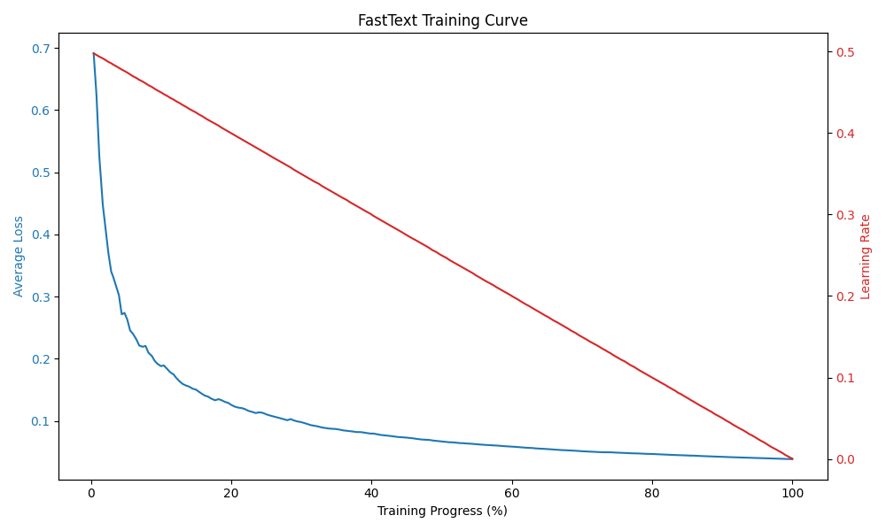

# FastText 数学文本分类项目

## 项目简介

本项目基于 FastText 实现了一个简单高效的数学文本分类器，区分`math`（数学相关文本）与`other`（非数学文本）两类。
项目包含数据预处理、模型训练及评估代码，评测结果达到`98%`的准确率。

---

## 目录结构

```sh
.
├── data
│   ├── fineweb_samples.txt
│   ├── openwebmath_samples.txt
│   ├── test.txt # 测试数据，格式：__label__xxx 文本
│   └── train.txt # 训练数据，格式：__label__xxx 文本
├── log
│   ├── training.log
│   └── training_curve.png
├── src
│   ├── evaluate.py # 评估脚本
│   ├── format_data.py # 数据预处理
│   ├── plot_training.py
│   ├── preprocess.py # 数据加载
│   └── train.py # 训练脚本
├── README.md
├── model.bin
├── example.ipynb # 示例
└── requirement.txt
```

---

## 环境依赖

使用`conda`管理环境，并安装以下依赖：

- datasets
- fasttext
- scikit-learn
- matplotlib

```sh
conda create --name fasttextmath python=3.10 -y
conda activate fasttextmath
pip install -r requirements.txt
```

### `fasttext`报错处理

```sh
ValueError: Unable to avoid copy while creating an array as requested.
If using np.array(obj, copy=False) replace it with np.asarray(obj) to allow a copy when needed (no behavior change in NumPy 1.x).
For more details, see https://numpy.org/devdocs/numpy_2_0_migration_guide.html#adapting-to-changes-in-the-copy-keyword.
```

请将`your_anaconda3_dir/envs/fasttextmath/lib/python3.10/site-packages/fasttext/FastText.py`
第239行中`_FastText`类的`predict`方法的返回值，由

```py
return labels, np.array(probs, copy=False)
```

改为：

```py
return labels, np.asarray(probs)
```

以解决`numpy`包版本冲突问题。

---

## 数据获取与预处理

本项目数据主要来自两个公开语料库：

- **数学文本数据集**：`open-web-math/open-web-math`
- **非数学文本数据集**：`HuggingFaceFW/fineweb`


---

### 1. 数据获取与采样

- 使用 `datasets` 的 `load_dataset` 方法从指定数据集及分片中**流式**加载文本数据，避免一次性加载大量数据导致内存压力。
- 对采样文本做简单的质量过滤（至少包含5个词），保证语料的基本可用性。
- 通过随机数种子确保采样的可复现性。

### 2. 训练/测试数据格式构造

- 将正负样本文本分别读取并添加 `FastText` 所需标签格式。
- 对合并后的样本进行随机打乱，确保训练和测试集分布均匀。
- 按照`8:2`划分测试集、训练集。
- 生成两个符合 `FastText` 标准输入格式的文本文件，形如：

### 数据格式

```
__label__math 数学相关文本
__label__other 非数学文本
```

---

## 模型训练

基于 `FastText` 的 `train_supervised` 接口进行训练，用于对文本进行二分类（。训练过程中指定了一系列超参数，具体如下：

```sh
lr: 0.5
epoch: 10
wordNgrams: 2
dim: 100
```

训练过程如下图：


---

## 模型评估

从如下指标进行评估：
- precision
- recall
- f1-score
- support

并绘制混淆矩阵。

## 评测结果

### Classification Report

| Label            | Precision | Recall | F1-score | Support   |
| ---------------- | --------- | ------ | -------- | --------- |
| `__label__math`  | 0.98      | 0.97   | 0.98     | 5948      |
| `__label__other` | 0.97      | 0.99   | 0.98     | 6052      |
| **Accuracy**     |           |        | **0.98** | **12000** |
| **Macro avg**    | 0.98      | 0.98   | 0.98     | 12000     |
| **Weighted avg** | 0.98      | 0.98   | 0.98     | 12000     |

---

### Confusion Matrix

|                             | True | FALSE |
| --------------------------- | ------------------------- | -------------------------- |
| **Positive**  | 5794                      | 154                        |
| **Negative** | 89                        | 5963                       |

> `__label__math`记为`Positive`，`__label__other`记为`Negative`。

该结果表明模型在测试集上分类效果优异。

---

## 使用

1. 数据获取

```sh
python src/preprocess.py
```

2. 数据预处理
```sh
python src/format_data.py
```

3. 训练

```sh
nohup python src/train.py >> log/training.log 2>&1 &
```

4. 评价

```sh
python plot_training.py
python evaluate.py
```

---

## 打标后的示例fineweb数据

[示例数据](result/predicted_samples.txt)
运行`src/run.py`得到示例数据。

---
